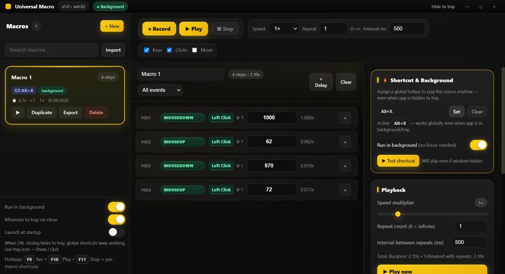

<div align="center">

# ⚡ Universal Macro
### Your computer does the boring work — you relax.

**Record any keyboard & mouse action once. Play it anytime with one shortcut — even while the app is hidden.**

</div>

<div align="center">



*Clean, fast, yellow & black — built to stay out of your way.*

[]()
[]()
[]()

[Download](#-download--run) • [How to Use](#-how-to-use-in-3-steps) • [Shortcuts](#-shortcuts)

</div>

---

### What is Universal Macro?

Universal Macro is a small desktop app that **watches what you do and repeats it for you**.

- Do you type the same thing every day?
- Click the same buttons over and over?
- Fill the same form, test the same app, grind the same game task?

**Just hit Record, do it once, and let the app do it forever.**

No coding. No complex setup. Just Record → Edit → Play.

---

### ✨ Why you'll love it

| What it does | Why it's nice |
|---|---|
| **🎥 Records everything** | Keyboard, mouse clicks, scrolls — even mouse moves if you want |
| **✏️ Easy timeline to edit** | See every step, change the waiting time, drag to reorder, delete what you don't need |
| **⚡ Plays at any speed** | Slow it down or make it 5x faster. One click. |
| **🔁 Repeats as you like** | Play once, 10 times, or forever until you hit Stop. Add a pause between repeats. |
| **⌨️ One key to run any macro** | Give each macro its own shortcut like `Ctrl + Shift + Q` or `F6` |
| **👻 Runs in background** | Minimize to the system tray — shortcuts still work even when hidden |
| **🔴 Smart recording** | App hides itself when recording and shows only a tiny red **Stop** pill at the top-right |
| **💛 Beautiful & fast** | Yellow & black theme, smooth animations, pretty scrollbars, light on your PC |

---

### 📸 Inside the App

- **Left:** Your macros — name, shortcut, time, and steps
- **Middle:** The timeline — every key and click is shown clearly (`A`, `Enter`, `Left Click @ 512,320`)
- **Right:** Controls — change speed, repeats, set a shortcut, and run in background

> The screenshot above is the real app — what you see is what you get.

---

### 🚀 How to Use in 3 Steps

#### 1. Create & Record
Click **`+ New`** → Click **`● Record`** → The app hides, a tiny red **Stop** appears at the top-right → Do your task normally (type, click, scroll).

*Tip: F9 also starts recording.*

#### 2. Edit (optional but powerful)
You come back and see every step in the middle panel:
- Change the **Delay (ms)** numbers to make it faster or slower
- Drag rows to change order
- Add a **Delay** to insert a pause
- Filter by `Key / Mouse` to find things fast

#### 3. Play — Anytime, Anywhere
- Click **`▶ Play`** or press your **macro's own shortcut**
- It works even if the app is hidden in the tray!
- Hit **`■ Stop`** or `F11` to stop. `F9` to record again.

That's it. No manual needed.

---

### ⌨️ Shortcuts

| Key | Does what |
|---|---|
| **F9** | Start / Stop recording |
| **F10** | Play the first macro |
| **F11** | Stop playing |
| **Your own** | `Ctrl+Shift+...` or `F6` etc. — set per macro on the right panel → **Set** → press your keys → **Save** |

When the shortcut box is **green**, it's listening — just press your keys.

---

### 🔧 Simple Settings

On the right panel and left bottom:

- **Run in background** — Keep running when you close the window
- **Minimize to tray on close** — Closing hides to tray instead of quitting
- **Launch at startup** — Starts with your computer
- **Speed / Repeat / Interval** — How fast and how many times to repeat
- **Keys / Clicks / Move** — Choose what to record

Right-click the **tray icon** (bottom-right near the clock) to **Show, Run any macro, or Quit**.

---

### 📥 Download & Run — Windows Only

> ⚠️ Works on **Windows 10 / 11 (64-bit)** only.

**For everyone — use the setup:**

1. Go to **Releases** and download **`Universal Macro Setup 1.0.0.exe`** (84 MB)
2. Double-click it → Choose where to install → Click **Install**
3. Open **Universal Macro** from Start Menu or Desktop → Create your first macro

*No setup hassle — installer adds it to Start Menu and you can uninstall anytime from Settings → Apps.*

**Portable (no install):**
Unzip `dist/win-unpacked` and run **`Universal Macro.exe`** directly.

**For developers:**

```bash
npm install
npm run dev          # run with hot reload
npm run build        # make the app
npm run package      # portable exe in dist/win-unpacked
npm run make:win     # setup exe in dist/Universal Macro Setup 1.0.0.exe
```

Your macros are saved automatically on your computer — safe and offline.

---

### 💡 Tips & Tricks

- **Don't worry about F9 being recorded** — the app automatically ignores the F9 key you pressed to start/stop.
- **Clicking the red Stop pill is ignored too** — it won't become part of your macro.
- **Hidden but working** — After saving a shortcut, you can minimize the app and still trigger the macro from any program or game.
- **Make it human** — Add a little delay (100-200ms) between fast clicks if a website needs time to load.

---

### ❓ FAQ

**Is it heavy?** No. It's light and fast, made to stay in the background.

**Does it work offline?** Yes, 100% offline. Nothing is sent to the internet.

**Can I share a macro?** Yes — `Export` any macro to a `.json` file and `Import` it on another PC.

**Will it record my passwords?** It records what you type while recording. Don't record sensitive typing, or delete that step from the timeline after.

---

<div align="center">

**Made with yellow, black, and a little magic.**

If you like it, give it a ⭐ on GitHub!

</div>
